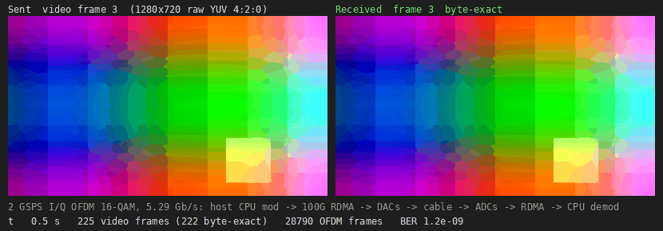

-9A90FD.svg) -orange.svg) -purple.svg)   

[English](#en) | [中文](#cn)

　

<span id="en">RFSoC 4x2: 2 GSPS OFDM with the host CPU as the modem, over 100G RDMA</span>
===========================

Continuous I/Q streaming between a Linux host and the RF data converters of the RFSoC 4x2 (XCZU48DR), carried by RoCE v2 (AMD ERNIC) on the QSFP28 port: **64 Gbit/s to the DACs and 64 Gbit/s from the ADCs at the same time, i.e. 2.0 GSPS × I/Q × 16 bit each way.** The OFDM transmitter and receiver run in C on the host CPU. Through a loopback cable (DAC_A → ADC_B for I, DAC_B → ADC_D for Q, multi-tile synchronised) the link carries **raw, uncompressed 720p video at 478 frames/s: 16-QAM, 5.29 Gb/s of payload, 61035 OFDM frames per second, 60 s, 99.7 % of the video frames byte-exact, BER 4 × 10⁻⁵** (about 2 × 10⁻¹⁰ between host hiccups).

It combines [rfsoc4x2_ernic](https://github.com/uceeyuf/rfsoc4x2_ernic) (100G RDMA) with [rfsoc4x2_mts](https://github.com/uceeyuf/rfsoc4x2_mts) (multi-tile sync, I/Q OFDM), both ported to Vivado 2023.2 and the RF side to 2.0 GSPS.

　

|  |
| :--------------------------------: |
| **Figure1** : the video frame sent (left) and received (right), counters at that moment |

　

## How it works

```
host CPU: video -> scrambler -> OFDM modulator (3 threads) -> TX frame ring --RDMA WRITE--> rf_stream TX ring (1 MB) -> DAC_A / DAC_B
host CPU: checker <- OFDM demodulators (9 threads) <- RX ring (16 MB) <--RDMA WRITE WITH IMMEDIATE-- rf_stream RX ring (1 MB) <- ADC_B / ADC_D
```

* **rf_stream** (`hw/rtl/rf_stream.v`) sits in ERNIC's on-chip window at `0x8000_0000` behind an address split.
  * **TX**: the host RDMA WRITEs samples into the TX ring and posts its write pointer. The player sends 512 bits every two 250 MHz RF cycles to the DACs (8 samples per rail per cycle). The host paces itself on the read pointer, read with an RDMA READ of a 64-byte status word.
  * **RX**: the ADCs fill 64 KB chunks. Every full chunk rings ERNIC's SQ doorbell over the hardware handshake ports. One of 256 pre-filled RDMA WRITE WITH IMMEDIATE WQEs then sends the chunk to host ring slot *k* (immediate *k*), and its completion frees the chunk. No processor is involved on either path.
  * **Keeping time**: the TX read pointer never waits. A word the host has not written in time plays as zeros, so later samples stay on the time grid, and the host skips ahead.
  * **Restarting**: ERNIC keeps its SQ consumer index when a QP is configured again, so the SQ producer index runs on from run to run.
* **Clocks**: ERNIC runs at 200 MHz and the RF fabric at 250 MHz (2.0 GSPS, 8 samples per cycle). The MTS block design (LMK04828 / LMX2594 from the A53, tile 2 PLL, SYSREF 5 MHz) comes from rfsoc4x2_mts.
* **Host modem** (`host/ofdm_modem.c`): N = 1024, CP = 128, 890 active sub-carriers (±16 … ±460) with 56 pilots. A frame of 32768 samples holds 2 training symbols, 26 data symbols and 512 zeros. The receiver uses a widely linear equaliser that also removes the I/Q image.
  * FFTW-based.
  * Transmitter: about 1 GS/s per core.
  * Receiver: about 310 MS/s per core on a Core Ultra 7 265K.
* **rf_ofdm** (`host/rf_ofdm.c`):
  * Sends the payload scrambled: flat video would otherwise put the same point on every sub-carrier, and the IFFT turns that into one huge peak.
  * Locks to the frame grid once. The ADCs and DACs share the sample clock, so the grid then holds.
  * Demodulates every frame at its known position.
  * Checks the sequence numbers and bit errors against the source, and reassembles the video.
  * Locks again by itself if the grid moves, for example after an RX overflow, whose shift the FPGA counts exactly.

　

## Results

Host: Core Ultra 7 265K (8 P + 12 E cores), Mellanox ConnectX-4, Ubuntu 24.04. Board: RFSoC 4x2, SMA loopback DAC_A → ADC_B, DAC_B → ADC_D.

| Test | Result |
| :--- | :----- |
| Streaming (`rf_stream_host`, tone), 8 s | 64.00 Gbit/s to the DACs and 64.00 Gbit/s from the ADCs, 0 RX gaps, 0 TX underflows, 0 RX overflows |
| OFDM video (`rf_ofdm`), 60 s | 61035 frames/s (2.0 GSPS), 16-QAM 5.29 Gb/s, 28653 raw 720p frames, 28563 byte-exact, 3.66 M OFDM frames, BER 4.0 × 10⁻⁵, 0 relocks ([log](./docs/results/ofdm_stream_2gsps_60s_log.txt)) |
| OFDM from the A53 (buffer mode, MTS) | 16-QAM 5.29 Gb/s 0 errors (EVM −27.4 dB), 64-QAM 7.94 Gb/s BER 4 × 10⁻⁴, 256-QAM 10.59 Gb/s BER 6 × 10⁻³ ([log](./docs/results/ofdm_2gsps_board_log.txt)) |
| MTS | DAC_B / ADC_D vs DAC_A / ADC_B after sync: +0.012 … +0.014 samples (6 … 7 ps) ([log](./docs/results/mts_2gsps_board_log.txt)) |
| Timing | all constraints met, WNS +0.187 ns ([report](./docs/results/rdma_ofdm_timing_summary.rpt), [utilisation](./docs/results/rdma_ofdm_utilization.rpt)) |

The remaining errors come in short bursts: every few seconds the host falls behind for some tens of µs (a system-wide pause, not the modem's speed), the FPGA plays a few words of zeros, and a few frames are lost. The frame grid holds.

　

## Build and run

Requirements:
* Vivado / Vitis 2023.2 with an ERNIC licence.
* RFSoC 4x2 board files ([RealDigitalOrg/RFSoC4x2-BSP](https://github.com/RealDigitalOrg/RFSoC4x2-BSP), in `~/fpga/board_files`).
* rdma-core and libfftw3f.
* The host port at 192.168.100.2/24 with MTU 9000.

```sh
git submodule update --init
vivado -mode batch -source hw/scripts/build.tcl -tclargs 4          # build/rdma_ofdm.bit, .xsa (4 parallel runs: 30 GB RAM)
xsct sw/create_vitis.tcl build/rdma_ofdm.xsa sw/vitis_rdma          # A53 application: clocks, RF tiles, MTS
host/build.sh                                                        # ofdm_bench, rf_stream_host, rf_ofdm
tests/stream_up.sh 1 host/rf_stream_host --seconds 10 --tx tone:100  # program, MTS, configure ERNIC, stream a tone
tests/stream_up.sh 0 host/rf_ofdm --seconds 60 --save build/rx.yuv --save-frames 120 --save-every 225
python3 host/make_gif.py build/rx.yuv 1280x720 docs/img/ofdm_720p.gif
```

* `tests/stream_up.sh 1` loads the bitstream and the A53 application over JTAG, then sends key `m` (MTS) over the UART.
* The host program writes its QP number, MAC and RX ring address to `build/stream_params.txt`. `tests/stream_config.tcl` programs ERNIC over JTAG-to-AXI and signals the host.
* Without a board, `host/rf_ofdm --sim 1` loops the TX stream back in memory, and `host/ofdm_bench` measures the modem's speed.
* The standalone MTS design (buffer play / capture, A53 OFDM) is still built by `hw/scripts/make_mts.tcl` and `build_mts.tcl`.

　

## Files

| Path | |
| :--- | :-- |
| `hw/rtl/rdma_ofdm_top.v` | top level: CMAC, ERNIC, DDR4, address splits, MTS block design, rf_stream |
| `hw/rtl/rf_stream.v` | TX / RX rings, doorbells, status word |
| `hw/scripts/mts_bd.tcl` | MTS block design (RFDC, clocks, players, captures; DAC source mux and ADC taps when integrated) |
| `host/rf_ofdm.c` | continuous OFDM video link |
| `host/rf_stream_host.c` | streaming test (tone) |
| `host/rdma_link.c` | RC QP to ERNIC, clean stop |
| `host/ofdm_modem.c`, `ofdm_bench.c` | OFDM modem and its benchmark |
| `sw/src` | A53 application (clocks, RF tiles, MTS, buffer-mode OFDM) |
| `tests/stream_config.tcl`, `stream_up.sh` | ERNIC configuration over JTAG, bring-up |

　

<span id="cn">RFSoC 4x2：主机 CPU 做调制解调的 2 GSPS OFDM（100G RDMA）</span>
===========================

Linux 主机与 RFSoC 4x2（XCZU48DR）射频数据转换器之间的连续 I/Q 流，由 QSFP28 口上的 RoCE v2（AMD ERNIC）承载：**同时 64 Gbit/s 送往 DAC、64 Gbit/s 来自 ADC，即双向 2.0 GSPS × I/Q × 16 bit。** OFDM 发射机和接收机都在主机 CPU 上用 C 实现。经过环回线缆（I：DAC_A → ADC_B，Q：DAC_B → ADC_D，多 tile 同步），链路传送**未压缩的原始 720p 视频，478 帧/s：16-QAM，净荷 5.29 Gb/s，每秒 61035 个 OFDM 帧，连续 60 s，99.7 % 的视频帧逐字节正确，BER 4 × 10⁻⁵**（主机抖动间隙之外约 2 × 10⁻¹⁰）。

本仓库结合了 [rfsoc4x2_ernic](https://github.com/uceeyuf/rfsoc4x2_ernic)（100G RDMA）与 [rfsoc4x2_mts](https://github.com/uceeyuf/rfsoc4x2_mts)（多 tile 同步、I/Q OFDM），两者移植到 Vivado 2023.2，射频侧提到 2.0 GSPS。

## 原理

* **rf_stream**（`hw/rtl/rf_stream.v`）位于 ERNIC 片上窗口 `0x8000_0000`。
  * **TX**：主机用 RDMA WRITE 写 1 MB TX 环并更新写指针，播放器每两个 250 MHz 周期向 DAC 送 512 bit；主机通过 RDMA READ 64 字节状态字获得读指针来定速。
  * **RX**：ADC 填满 64 KB 块后，经硬件握手口敲 ERNIC 的 SQ 门铃，由 256 个预置的 RDMA WRITE WITH IMMEDIATE WQE 发到主机环第 *k* 槽，完成后释放该块，全程无处理器参与。
  * **按时间走**：TX 读指针从不等待，主机没来得及写的字播放为零，后续样本保持在时间网格上，主机跳帧追上。
  * **重跑**：ERNIC 重新配置 QP 时保留 SQ 消费指针，因此 SQ 生产指针跨运行累加。
* **主机调制解调**（`host/ofdm_modem.c`）：N = 1024、CP = 128，890 个有效子载波（±16 … ±460），其中 56 个导频；每帧 32768 个样本，含 2 个训练符号、26 个数据符号和 512 个零。
  * 基于 FFTW。
  * 发射每核约 1 GS/s，接收每核约 310 MS/s。
  * 接收端用宽线性均衡器，同时去除 I/Q 镜像。
* **rf_ofdm**（`host/rf_ofdm.c`）：
  * 载荷先加扰码：平坦的视频会让所有子载波落在同一星座点，IFFT 后形成巨大峰值。
  * 只锁定一次帧网格：ADC 与 DAC 共用采样时钟，锁定后网格保持不变。
  * 按已知位置解调每一帧。
  * 对照源数据检查序号和误码，并重组视频。
  * 网格移动时自动重锁，例如 RX overflow 后，FPGA 精确记录了平移量。

## 结果

| 测试 | 结果 |
| :--- | :--- |
| 流测试（单音）8 s | 双向 64.00 Gbit/s，0 RX gap，0 TX underflow，0 RX overflow |
| OFDM 视频 60 s | 61035 帧/s（2.0 GSPS），16-QAM 5.29 Gb/s，28653 帧原始 720p 中 28563 帧逐字节正确，BER 4.0 × 10⁻⁵，0 次重锁 |
| A53 OFDM（缓冲模式，MTS） | 16-QAM 5.29 Gb/s 0 误码（EVM −27.4 dB），64-QAM 7.94 Gb/s BER 4 × 10⁻⁴，256-QAM 10.59 Gb/s BER 6 × 10⁻³ |
| MTS | 同步后 DAC_B / ADC_D 相对 DAC_A / ADC_B：+0.012 … +0.014 样本（6 … 7 ps） |
| 时序 | 全部满足，WNS +0.187 ns |

剩余误码集中在短时突发：主机每隔几秒会停顿几十微秒（系统级停顿，而不是调制解调算不过来）。这时 FPGA 播放几个字的零，丢失几帧，帧网格保持不变。

构建与运行步骤见上文英文部分。

　

## License

BSD 3-Clause, Copyright (c) 2026 Yijie Yu. `third_party/verilog-ethernet` (MIT) by Alex Forencich.
