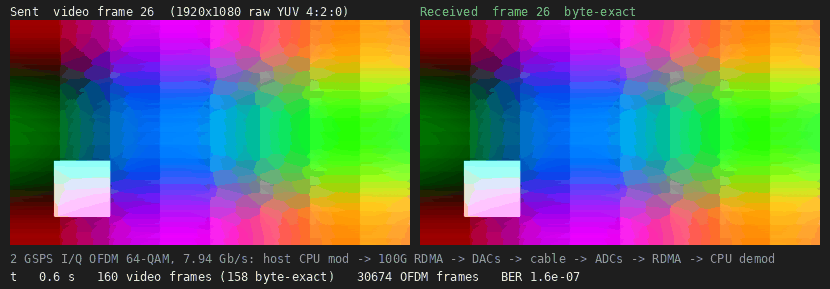
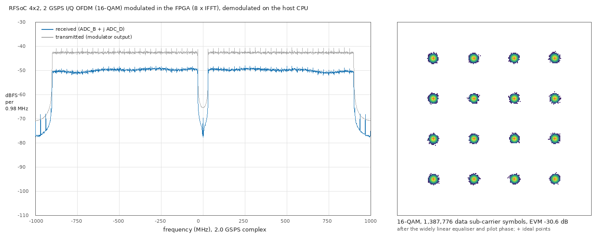
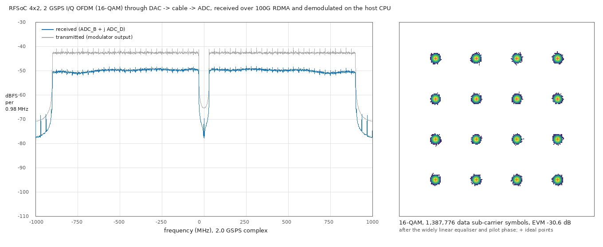
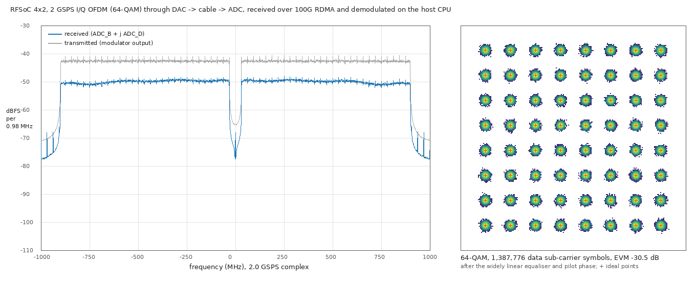
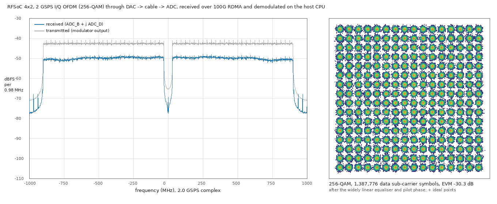

-9A90FD.svg) -orange.svg) -purple.svg)   

[English](#en) | [中文](#cn)

　

<span id="en">RFSoC 4x2: 2 GSPS OFDM with the host CPU as the modem, over 100G RDMA</span>
===========================

Continuous I/Q streaming between a Linux host and the RF data converters of the RFSoC 4x2 (XCZU48DR), carried by RoCE v2 (AMD ERNIC) on the QSFP28 port: **64 Gbit/s to the DACs and 64 Gbit/s from the ADCs at the same time, i.e. 2.0 GSPS × I/Q × 16 bit each way.** The OFDM transmitter and receiver run in C on the host CPU. Through a loopback cable (DAC_A → ADC_B for I, DAC_B → ADC_D for Q, multi-tile synchronised) the link carries raw, uncompressed video:

* **16-QAM**: 5.29 Gb/s of payload, 720p at 478 frames/s. In 60 s, 58 of 59 seconds were free of bit errors (BER < 10⁻⁸), 99.6 % of the video frames were byte-exact, and the overall BER was 3 × 10⁻⁵.
* **64-QAM**: 7.94 Gb/s of payload, 1080p at 319 frames/s. The median BER per second was 2 × 10⁻⁷ (the cable's SNR), and 97.4 % of the video frames were byte-exact.
* **The transmitter also runs in the FPGA** (`ofdm_tx`: 8 × 1024-point IFFT, bit-exact with its C model). The host then sends only payloads (5.3 Gb/s at 16-QAM instead of 64 Gb/s of samples) from one thread. 16-QAM for 30 s: every second free of bit errors, BER 5.9 × 10⁻¹⁰, EVM −30.6 dB, the same as with the CPU modulator.
* **So does the receiver** (`ofdm_rx`: 8 × 1024-point FFT, widely linear equaliser, pilot phase, bit-exact with its C model). The host computes the channel coefficients once from 4 frames of samples, then only checks payloads. FPGA to FPGA, 16-QAM for 30 s: BER 2.0 × 10⁻¹⁰; 64-QAM 2.3 × 10⁻⁷, 256-QAM 2.1 × 10⁻⁴, the same as with the CPU receiver. Transmitter and receiver fit together with room to spare (BRAM 73 %, DSP 20 %).

It combines [rfsoc4x2_ernic](https://github.com/uceeyuf/rfsoc4x2_ernic) (100G RDMA) with [rfsoc4x2_mts](https://github.com/uceeyuf/rfsoc4x2_mts) (multi-tile sync, I/Q OFDM), both ported to Vivado 2023.2 and the RF side to 2.0 GSPS.

　

|  |
| :--------------------------------: |
| **Figure1** : 16-QAM, 720p: the video frame sent (left) and received (right), counters at that moment |

|  |
| :---------------------------------------: |
| **Figure2** : 64-QAM, 1080p |

　

## How it works

```
host CPU: video -> scrambler -> OFDM modulators (3 threads) -> TX frame ring (16 MB) --RDMA WRITE--> rf_stream TX ring (2 MB) -> DAC_A / DAC_B
host CPU: checker <- OFDM demodulators (12 threads) <- RX ring (64 MB) <--RDMA WRITE WITH IMMEDIATE-- rf_stream RX ring (512 KB) <- ADC_B / ADC_D
```

* **rf_stream** (`hw/rtl/rf_stream.v`) sits in ERNIC's on-chip window at `0x8000_0000` behind an address split.
  * **TX**: the host RDMA WRITEs samples into a 2 MB TX ring (262 µs at 8 GB/s) and posts its write pointer. The player sends 512 bits every two 250 MHz RF cycles to the DACs (8 samples per rail per cycle). The host paces itself on the read pointer, read with an RDMA READ of a 64-byte status word.
  * **RX**: the ADCs fill 64 KB chunks. Every full chunk rings ERNIC's SQ doorbell over the hardware handshake ports. One of 1024 pre-filled RDMA WRITE WITH IMMEDIATE WQEs then sends the chunk to host ring slot *k* (immediate *k*), and its completion frees the chunk. No processor is involved on either path.
  * **Keeping time**: the TX read pointer never waits. A word the host has not written in time plays as zeros, so later samples stay on the time grid, and the host skips ahead. An RX overflow drops whole 512-bit words, which the FPGA counts.
  * **Restarting**: ERNIC keeps its SQ consumer index when a QP is configured again, so the SQ producer index runs on from run to run. The host stops cleanly, waiting until every RX chunk is completed.
* **Clocks**: ERNIC runs at 200 MHz and the RF fabric at 250 MHz (2.0 GSPS, 8 samples per cycle). The MTS block design (LMK04828 / LMX2594 from the A53, tile 2 PLL, SYSREF 5 MHz) comes from rfsoc4x2_mts.
* **Host modem** (`host/ofdm_modem.c`): N = 1024, CP = 128, 890 active sub-carriers (±16 … ±460) with 56 pilots. A frame of 32768 samples holds 2 training symbols, 26 data symbols and 512 zeros. The receiver uses a widely linear equaliser that also removes the I/Q image.
  * FFTW-based when libfftw3f is installed (a built-in radix-2 FFT otherwise).
  * Transmitter: about 1 GS/s per core.
  * Receiver: about 310 MS/s per core on a Core Ultra 7 265K.
* **rf_ofdm** (`host/rf_ofdm.c`):
  * Sends the payload scrambled: flat video would otherwise put the same point on every sub-carrier, and the IFFT turns that into one huge peak.
  * Locks to the frame grid once. The ADCs and DACs share the sample clock, so the grid then holds.
  * Demodulates every frame at its known position, from a copy taken out of the ring.
  * Checks the sequence numbers and bit errors against the source, and reassembles the video.
  * Moves the grid by the exact shift after an RX overflow (16 samples per dropped word), and falls back to a full frame search if headers stay bad.

　

## The FPGA transmitter

`hw/rtl/ofdm_tx.v` is the host's streaming modulator in hardware, 8 samples per 250 MHz cycle (2 GSPS). It is switched on by control bit 3 of rf_stream; the TX ring then holds 32 KB payload slots.

* **Schedule.** A frame is 4096 cycles: symbol *n* starts at cycle *n* × 144. The symbols go in turn to 8 lanes, each with a 1024-point IFFT (xfft v9.1, pipelined, 16-bit input and twiddles, unscaled). A lane takes 1024 cycles per symbol, so 8 lanes carry the 144-cycle symbol rate.
* **Lane.** Each lane feeds its IFFT bin by bin:
  * the bin table gives empty, pilot or data and the data index;
  * the data bits come from the payload buffer (UltraRAM, 72-bit words, so a group of m ≤ 8 bits never spans two words);
  * each axis is Gray-decoded and mapped to a level already scaled by K = gain × 64.
  * A small FIFO in front of the IFFT absorbs the cycles in which the core drops `tready` as a frame starts.
* **Output.** The 27-bit IFFT output becomes sat16(⌊(y + 32) / 64⌋), the host modulator's level and clipping. It goes into ping-pong banks, and is read out 8 wide with the cyclic prefix, 3600 cycles after the symbol's input started (the IFFT latency is 2175 cycles).
* **Keeping time.** A payload not written in time is modulated as zeros and counted; the frame grid stays.
* **Verification.**
  * `host/ofdm_txfx` models the transmitter bit-exactly, with the same tables and AMD's bit-accurate xfft C model. It is within 1 LSB of the floating-point modulator, and the host receiver decodes it without errors.
  * `hw/sim/run_ofdm_tx.sh` simulates the RTL (xsim, with the IP) and compares every sample: identical for QPSK, 16, 64 and 256-QAM.
* **Resources.** The transmitter takes 34 BRAM36, 8 UltraRAM and 321 DSP (each IFFT: 4 BRAM36, 40 DSP). The design's BRAM goes mostly to rf_stream's sample rings, used when the host modulates or demodulates.

|  |
| :-------------------------------------------: |
| **Figure3** : 16-QAM modulated in the FPGA: the same spectrum and EVM (−30.6 dB) as from the CPU |

　

## The FPGA receiver

`hw/rtl/ofdm_rx.v` demodulates 8 samples per 250 MHz cycle with a static channel. Control bit 4 of rf_stream switches it on, also during a run: from the next chunk boundary the RX ring holds one 32 KB payload slot per frame instead of samples, and status word +0x1C gives that chunk.

* **Host-assisted start.** `rf_ofdm --fpga-rx 1` first locks to the frame grid in sample mode as usual. It then:
  * sums the FFTs of the training symbols of 4 frames and computes the coefficients (`host/ofdm_rxcoef.c`: A / B, the back-off phase ramp removed, a 7-tap smoother, the widely linear 2 × 2 inverse per pair (k, −k), int18 with one exponent);
  * computes the rotation gain from the known amplitude (not from the pilots: their coherent sum shrinks with the residual phase across the band);
  * writes the 445 coefficient words (`+0x28_8000`), the gain and the window position in RX time (status +0x24 gives the time of the run's first sample; the time counter never stops, so the grid carries over), and switches.
* **Lanes.** Data symbols 2 … 27 go in turn to 8 lanes. A lane stores the 1024 samples in 128 cycles and feeds its FFT (xfft v9.1, forward, unscaled); Y = sat18(round(Y27 / 16)) goes into one half of a ping-pong buffer.
* **Pair engine.** Per pair (k, −k): x = M y with int18 coefficients (>> 16).
  * The 28 pilot pairs come first. Their sum goes to one shared float32 unit (`ofdm_rx_rot.v`: multiply, add, square root, divide IP, one after another), which returns the unit phase × gain as int18.
  * Then the 417 data pairs: v = x · rot (>> 14), sliced on the grid of odd integers × 2¹⁰, Gray, m bits into the lane's bit buffers by payload index.
* **Packer.** The symbols in order, 8 sub-carriers per cycle, into 512-bit words; each frame padded to 512 words, at most one word every other cycle (the ring's clock crossing drains 200 M words/s).
* **Verification.**
  * `host/ofdm_rxfx` models every step bit-exactly (AMD's xfft C model, float32 in the RTL's order). On board dumps its decisions match the floating-point receiver: identical at 16 and 64-QAM, 3 × 10⁻⁵ of the bits differ at 256-QAM; EVM −30.6 / −30.5 / −30.3 dB.
  * `hw/sim/run_ofdm_rx.sh DUMP` simulates the RTL on the dump's samples and compares every payload bit: identical at 16, 64 and 256-QAM.
* **Resources.** The receiver takes 68.5 BRAM36, 516 DSP and 32 k LUT; no UltraRAM.

　

## Results

Host: Core Ultra 7 265K (8 P + 12 E cores), Mellanox ConnectX-4 (PCIe 3.0 x16), Ubuntu 24.04, CPUs 4-7 isolated. Board: RFSoC 4x2, SMA loopback DAC_A → ADC_B, DAC_B → ADC_D.

| Test | Result |
| :--- | :----- |
| Streaming (`rf_stream_host`, tone), 10 s | 64.00 Gbit/s to the DACs and 64.00 Gbit/s from the ADCs, 0 RX gaps, 0 TX underflows, 0 RX overflows |
| OFDM 16-QAM, raw 720p, 60 s | 61035 OFDM frames/s (2.0 GSPS), 5.29 Gb/s, 3.66 M OFDM frames, 58 / 59 s without errors, 28551 of 28660 video frames byte-exact, BER 3.1 × 10⁻⁵ (all from one RX overflow), 0 TX underflows ([log](./docs/results/ofdm_stream_16qam_720p_60s_log.txt)) |
| OFDM 64-QAM, raw 1080p, 60 s | 7.94 Gb/s, per-second BER median 2.3 × 10⁻⁷, 18621 of 19120 video frames byte-exact, BER 2.0 × 10⁻⁴ (mostly one RX stall) ([log](./docs/results/ofdm_stream_64qam_1080p_60s_log.txt)) |
| OFDM 256-QAM, 20 s (`--tx-threads 4`) | 10.58 Gb/s, BER 1.8 × 10⁻⁴ in every second (the SNR limit; a payload this size needs FEC), 0 TX underflows, 0 relocks ([log](./docs/results/ofdm_stream_256qam_20s_log.txt)) |
| OFDM, FPGA transmitter (`--fpga-tx 1`, one host TX thread), 16-QAM 720p, 30 s | 29 / 29 s without errors, BER 5.9 × 10⁻¹⁰ (93 bits in 1.6 × 10¹¹), 14259 of 14338 video frames byte-exact, 0 TX underflows ([log](./docs/results/ofdm_fpga_tx_m4_30s_log.txt)) |
| OFDM, FPGA transmitter, 64-QAM 1080p / 256-QAM, 20 s | BER 2.3 × 10⁻⁷ / 1.9 × 10⁻⁴, as with the CPU modulator ([64](./docs/results/ofdm_fpga_tx_m6_20s_log.txt), [256](./docs/results/ofdm_fpga_tx_m8_20s_log.txt)) |
| OFDM, FPGA transmitter and receiver (`--fpga-tx 1 --fpga-rx 1`), 16-QAM 720p, 30 s | 1.83 M frames demodulated in the FPGA, BER 2.0 × 10⁻¹⁰ (32 bits in 1.6 × 10¹¹, at most 7.6 × 10⁻¹⁰ in any second), 14310 of 14338 video frames byte-exact, 0 TX underflows, 0 RX overflows ([log](./docs/results/ofdm_fpga_rx_m4_30s_log.txt)) |
| OFDM, FPGA transmitter and receiver, 64-QAM 1080p / 256-QAM, 20 s | BER 2.3 × 10⁻⁷ (per-second median 2.1 × 10⁻⁷) / 2.1 × 10⁻⁴, as with the CPU receiver ([64](./docs/results/ofdm_fpga_rx_m6_20s_log.txt), [256](./docs/results/ofdm_fpga_rx_m8_20s_log.txt)) |
| OFDM from the A53 (buffer mode, MTS) | 16-QAM 5.29 Gb/s 0 errors (EVM −27.4 dB), 64-QAM 7.94 Gb/s BER 4 × 10⁻⁴, 256-QAM 10.59 Gb/s BER 6 × 10⁻³ ([log](./docs/results/ofdm_2gsps_board_log.txt)) |
| MTS | DAC_B / ADC_D vs DAC_A / ADC_B after sync: +0.012 … +0.014 samples (6 … 7 ps) ([log](./docs/results/mts_2gsps_board_log.txt)) |
| Timing, resources (with the FPGA transmitter and receiver) | all constraints met (WNS +0.049 ns); BRAM 73 %, UltraRAM 85 %, DSP 20 %, LUT 43 % ([report](./docs/results/rdma_ofdm_timing_summary.rpt), [utilisation](./docs/results/rdma_ofdm_utilization.rpt), [by instance](./docs/results/rdma_ofdm_utilization_hierarchical.rpt)) |

**What the buffers are sized for.** With the CPU busy, the NIC's DMA pauses for up to ~0.3 ms every few seconds, occasionally for several ms. The status READ and the data WRITEs stall together.
* The 2 MB TX ring bridges these pauses. With 1 MB, every pause was a TX underflow.
* The 64 MB host RX ring (8 ms) covers demodulator threads that get preempted. With 16 MB, a few hundred frames per minute were overwritten before they were read.
* What is left is the rare pause longer than the 512 KB FPGA RX ring (65 µs): an RX overflow, after which the grid shift is exact.

A CPU package that reaches TjMax (105 °C) throttles, and each throttle event is such a pause. Keep the host cool, and keep sysfs reads (MSRs) off the RDMA engine's thread.

　

## Headroom: 4 GSPS

Does the loopback carry twice the band? The standalone MTS design also builds at 4.0 GSPS (`MTS_GSPS=4.0`, RF fabric 500 MHz, WNS +0.057 ns), and the A53 then plays and captures OFDM frames with the same N = 1024 over 62 MHz … 1.80 GHz. Buffer mode, 0.25 FS RMS per rail ([log](./docs/results/ofdm_4gsps_band_log.txt)):

| Band at 4 GSPS | Sub-carriers | 16-QAM: EVM, errors | 64-QAM: EVM, errors |
| :-- | :-: | :-- | :-- |
| full, 62 MHz … 1.80 GHz | 834 | −24.4 dB, 0 (10.59 Gb/s) | −24.0 dB, 1 × 10⁻³ (15.88 Gb/s) |
| lower half, 62 … 977 MHz | 440 | −27.8 dB, 0 | −28.6 dB, 0 |
| upper half, 977 MHz … 1.80 GHz | 396 | −29.4 dB, 0 | −28.6 dB, 0 |
| 2 GSPS for comparison, 31 … 898 MHz | 834 | −27.4 dB, 0 | −28.0 dB, 5 × 10⁻⁴ |

* The upper half is as clean as the lower one: the baluns and the cable pass 1 … 1.8 GHz without a notable loss.
* The full band is 3 dB worse, as expected. The total power is fixed by clipping, and each sub-carrier now collects noise over twice the bandwidth.
* So 4 GSPS doubles the rate at 3 dB less SNR. 16-QAM at 10.6 Gb/s is error-free even in buffer mode, which is about 3 dB worse than the streaming link.

　

## Spectrum and constellation

Taken from 64 frames of raw ADC samples of a running link (`rf_ofdm --dump`), processed by `host/ofdm_plots` and drawn by `host/plot_ofdm.py`.
* **Left**: the received PSD (blue) against the modulator's own output at the same digital level (grey).
  * Welch estimate: 2048-point FFT, Hann window, 0.98 MHz bins.
  * The analogue path costs about 8 dB, and the band (±898 MHz, 890 sub-carriers) stays flat within about ±1 dB.
  * The empty sub-carriers around DC (±31 MHz) and the guard bands above ±898 MHz show the noise floor near −77 dBFS.
* **Right**: every data sub-carrier symbol after the widely linear equaliser and the pilot phase correction, as a density plot, with the ideal points.
  * EVM is −30.6 / −30.5 / −30.3 dB for 16 / 64 / 256-QAM: the link is limited by its SNR, not by the modulation.

|  |
| :----------------------------------: |
| **Figure4** : 16-QAM, EVM −30.6 dB |

|  |
| :----------------------------------: |
| **Figure5** : 64-QAM, EVM −30.5 dB |

|  |
| :------------------------------------: |
| **Figure6** : 256-QAM, EVM −30.3 dB |

　

## Build and run

Requirements:
* Vivado / Vitis 2023.2 with an ERNIC licence.
* RFSoC 4x2 board files ([RealDigitalOrg/RFSoC4x2-BSP](https://github.com/RealDigitalOrg/RFSoC4x2-BSP), in `~/fpga/board_files`).
* rdma-core; libfftw3f (optional, GPL: see License).
* The host port at 192.168.100.2/24 with MTU 9000.
* For clean runs:
  * kernel command line `isolcpus=4-7 nohz_full=4-7 irqaffinity=0-3,8-19`, so the RDMA engine (CPU 7) and the TX threads (CPUs 4-6) run undisturbed;
  * `sudo tests/host_tune.sh` after every boot (governor `performance`).

```sh
git submodule update --init
vivado -mode batch -source hw/scripts/build.tcl -tclargs 4          # build/rdma_ofdm.bit, .xsa (4 parallel runs: 30 GB RAM)
xsct sw/create_vitis.tcl build/rdma_ofdm.xsa sw/vitis_rdma          # A53 application: clocks, RF tiles, MTS
host/build.sh                                                        # ofdm_bench, rf_stream_host, rf_ofdm
hw/sim/run.sh                                                        # rf_stream testbench (xsim)
tests/stream_up.sh 1 host/rf_stream_host --seconds 10 --tx tone:100  # program, MTS, configure ERNIC, stream a tone
tests/stream_up.sh 0 host/rf_ofdm --seconds 60 --save build/rx.yuv --save-frames 120 --save-every 225
tests/stream_up.sh 0 host/rf_ofdm --m 6 --video 1920x1080 --seconds 60
tests/stream_up.sh 0 host/rf_ofdm --fpga-tx 1 --tx-threads 1 --seconds 30        # the FPGA modulates
host/build_txfx.sh && host/ofdm_txfx tables hw/rtl/ofdm_tx_mem                  # transmitter tables
hw/sim/run_ofdm_tx.sh 4                                                          # RTL vs bit-exact model
tests/stream_up.sh 0 host/rf_ofdm --fpga-tx 1 --fpga-rx 1 --tx-threads 1 --seconds 30   # both in the FPGA
hw/sim/run_ofdm_rx.sh build/rx_m4.dump 3                                         # receiver RTL vs model on a dump
python3 host/make_gif.py build/rx.yuv 1280x720 docs/img/ofdm_720p.gif
tests/stream_up.sh 0 host/rf_ofdm --m 4 --seconds 4 --dump build/rx_m4.dump     # raw samples of 64 frames
host/ofdm_plots build/rx_m4.dump build/plot_m4                                  # EVM, spectrum, symbols
python3 host/plot_ofdm.py build/plot_m4 docs/img/ofdm_16qam.png
```

* `tests/stream_up.sh 1` loads the bitstream and the A53 application over JTAG, then sends key `m` (MTS) over the UART.
* The host program writes its QP number, MAC and RX ring address to `build/stream_params.txt`. `tests/stream_config.tcl` programs ERNIC over JTAG-to-AXI (1024 WQEs) and signals the host once Vivado has let go of the CPU.
* Without a board:
  * `host/rf_ofdm --sim 1` loops the TX stream back in memory;
  * `--sim-slip N` shifts it like an RX overflow;
  * `host/ofdm_bench` measures the modem's speed.
* The standalone MTS design (buffer play / capture, A53 OFDM) is still built by `hw/scripts/make_mts.tcl` and `build_mts.tcl`. At 4 GSPS:
  ```sh
  MTS_GSPS=4.0 vivado -mode batch -source hw/scripts/build_mts.tcl                       # build/mts4g_wrapper.xsa
  MTS_GSPS=4.0 xsct sw/create_vitis.tcl build/mts4g_wrapper.xsa sw/vitis_mts4g         # OFDM_K_LO / OFDM_K_HI: the band
  xsct sw/run_jtag.tcl sw/vitis_mts4g && python3 host/uart.py m a f o e
  ```

　

## Files

| Path | |
| :--- | :-- |
| `hw/rtl/rdma_ofdm_top.v` | top level: CMAC, ERNIC, DDR4, address splits, MTS block design, rf_stream |
| `hw/rtl/rf_stream.v` | TX / RX rings (RX in UltraRAM), doorbells, status word |
| `hw/rtl/ofdm_tx.v`, `ofdm_tx_mem/` | OFDM transmitter (8 × IFFT) and its tables |
| `hw/rtl/ofdm_rx.v`, `ofdm_rx_rot.v` | OFDM receiver (8 × FFT, equaliser, slicer, packer) and its float32 pilot rotation |
| `hw/sim/` | rf_stream, ofdm_tx and ofdm_rx testbenches |
| `hw/scripts/mts_bd.tcl` | MTS block design (RFDC, clocks, players, captures; DAC source mux and ADC taps when integrated) |
| `host/rf_ofdm.c` | continuous OFDM video link |
| `host/rf_stream_host.c` | streaming test (tone), with READ / WRITE latency statistics (`LAT=1`) |
| `host/rdma_link.c` | RC QP to ERNIC, clean stop |
| `host/ofdm_modem.c`, `ofdm_bench.c` | OFDM modem and its benchmark |
| `host/ofdm_plots.c`, `plot_ofdm.py` | spectrum, constellation and EVM from a raw sample dump |
| `host/ofdm_txfx.c` | bit-exact model of the FPGA transmitter (links AMD's xfft C model) |
| `host/ofdm_rxfx.c`, `ofdm_rxcoef.c` | bit-exact model of the FPGA receiver; its channel coefficients (also used by `rf_ofdm --fpga-rx`) |
| `sw/src` | A53 application (clocks, RF tiles, MTS, buffer-mode OFDM) |
| `tests/stream_config.tcl`, `stream_up.sh`, `host_tune.sh` | ERNIC configuration over JTAG, bring-up, host tuning |

　

## Citation

If this work helps your research, please cite it:

```bibtex
@misc{yu2026rfsoc4x2_rdma_ofdm,
    author = {Yijie Yu},
    title = {{RFSoC 4x2: 2 GSPS OFDM with the host CPU as the modem, over 100G RDMA}},
    year = {2026},
    howpublished = {\url{https://github.com/uceeyuf/rfsoc4x2_rdma_ofdm}},
    note = {GitHub repository},
}
```

GitHub also offers the citation under **Cite this repository** (from [CITATION.cff](CITATION.cff)).

　

## Credits

* RDMA side: [rfsoc4x2_ernic](https://github.com/uceeyuf/rfsoc4x2_ernic).
* RF side: [rfsoc4x2_mts](https://github.com/uceeyuf/rfsoc4x2_mts).
* URAM player / capture blocks (`third_party/rfsoc_mts`) and the MTS design approach: [Xilinx/RFSoC-MTS](https://github.com/Xilinx/RFSoC-MTS) (MIT, `third_party/rfsoc_mts/LICENSE`).
* Clock register values: PYNQ RFSoC4x2 `LMK04828_500.0` / `LMX2594_500.0`.
* SPI driver: from [RFSoC4x2_clock_LMK_LMX](https://github.com/uceeyuf/RFSoC4x2_clock_LMK_LMX).
* RF data converter driver: Xilinx `rfdc`.
* Ethernet / AXI stream modules: Alex Forencich's [verilog-ethernet](https://github.com/alexforencich/verilog-ethernet) (MIT, submodule pinned at `274831c`).
* PL DDR4 pin constraints (`hw/constraints/4x2_PL_DDR4.xdc`): the RFSoC 4x2 board's DDR4 constraints.
* Host FFT: [FFTW](https://www.fftw.org) (Frigo and Johnson).

　

## License

* The files of this design are BSD 3-Clause, Copyright (c) 2026, Yijie Yu.
* `third_party/rfsoc_mts` (AMD) and verilog-ethernet are MIT.
* ERNIC, CMAC, MIG, the RF data converter and the other AMD IP are generated from their configuration scripts and are not included; they need their own licenses.
* The host modem uses FFTW (GPL-2.0-or-later) when `libfftw3f` is installed: `host/build.sh` then links it, and binaries built that way fall under the GPL. Without FFTW the built-in FFT is used.

　

<span id="cn">RFSoC 4x2：主机 CPU 做调制解调的 2 GSPS OFDM（100G RDMA）</span>
===========================

Linux 主机与 RFSoC 4x2（XCZU48DR）射频数据转换器之间的连续 I/Q 流，由 QSFP28 口上的 RoCE v2（AMD ERNIC）承载：**同时 64 Gbit/s 送往 DAC、64 Gbit/s 来自 ADC，即双向 2.0 GSPS × I/Q × 16 bit。** OFDM 发射机和接收机都在主机 CPU 上用 C 实现。经过环回线缆（I：DAC_A → ADC_B，Q：DAC_B → ADC_D，多 tile 同步），链路传送未压缩的原始视频：

* **16-QAM**：净荷 5.29 Gb/s，720p 478 帧/s。60 s 中 58/59 秒无误码（BER < 10⁻⁸），99.6 % 的视频帧逐字节正确，总 BER 3 × 10⁻⁵。
* **64-QAM**：净荷 7.94 Gb/s，1080p 319 帧/s。每秒 BER 中位数 2 × 10⁻⁷（线缆 SNR 所限），97.4 % 的视频帧逐字节正确。
* **发射端也可以放在 FPGA 里**（`ofdm_tx`：8 个 1024 点 IFFT，与其 C 模型逐位一致）。此时主机只用一个线程发送净荷（16-QAM 时 5.3 Gb/s，而不是 64 Gb/s 的样本）。16-QAM 连续 30 s 每秒都无误码，BER 5.9 × 10⁻¹⁰，EVM −30.6 dB，与 CPU 调制相同。
* **接收端也可以放在 FPGA 里**（`ofdm_rx`：8 个 1024 点 FFT、宽线性均衡、导频相位，与其 C 模型逐位一致）。主机只在开始时用 4 帧样本算一次信道系数，之后只校验净荷。FPGA 到 FPGA，16-QAM 30 s BER 2.0 × 10⁻¹⁰；64-QAM 2.3 × 10⁻⁷，256-QAM 2.1 × 10⁻⁴，与 CPU 接收相同。发射和接收同时放下还有余量（BRAM 73 %，DSP 20 %）。

本仓库结合了 [rfsoc4x2_ernic](https://github.com/uceeyuf/rfsoc4x2_ernic)（100G RDMA）与 [rfsoc4x2_mts](https://github.com/uceeyuf/rfsoc4x2_mts)（多 tile 同步、I/Q OFDM），两者移植到 Vivado 2023.2，射频侧提到 2.0 GSPS。

## 原理

* **rf_stream**（`hw/rtl/rf_stream.v`）位于 ERNIC 片上窗口 `0x8000_0000`。
  * **TX**：主机用 RDMA WRITE 写 2 MB TX 环（8 GB/s 下可撑 262 µs）并更新写指针，播放器每两个 250 MHz 周期向 DAC 送 512 bit；主机通过 RDMA READ 64 字节状态字获得读指针来定速。
  * **RX**：ADC 填满 64 KB 块后，经硬件握手口敲 ERNIC 的 SQ 门铃，由 1024 个预置的 RDMA WRITE WITH IMMEDIATE WQE 发到主机环第 *k* 槽，完成后释放该块，全程无处理器参与。
  * **按时间走**：TX 读指针从不等待，主机没来得及写的字播放为零，后续样本保持在时间网格上，主机跳帧追上；RX 溢出按整个 512 bit 字丢弃，FPGA 记录丢弃数。
  * **重跑**：ERNIC 重新配置 QP 时保留 SQ 消费指针，因此 SQ 生产指针跨运行累加；主机退出前等所有 RX 块完成。
* **主机调制解调**（`host/ofdm_modem.c`）：N = 1024、CP = 128，890 个有效子载波，其中 56 个导频；每帧 32768 个样本。
  * 装有 libfftw3f 时使用 FFTW，否则用内置的 radix-2 FFT。
  * 发射每核约 1 GS/s，接收每核约 310 MS/s。
  * 接收端用宽线性均衡器，同时去除 I/Q 镜像。
* **rf_ofdm**（`host/rf_ofdm.c`）：
  * 载荷先加扰码，避免平坦视频在 IFFT 后形成巨大峰值。
  * 只锁定一次帧网格：ADC 与 DAC 共用采样时钟，锁定后网格保持不变。
  * 每帧先从环中拷出再解调。
  * 对照源数据检查序号和误码，并重组视频。
  * RX 溢出后按精确平移量移动网格（每丢一个字 16 个样本），帧头持续错误时再做全搜索。

## FPGA 发射端

`hw/rtl/ofdm_tx.v` 是主机流式调制器的硬件实现，每个 250 MHz 周期输出 8 个样本（2 GSPS），由 rf_stream 控制字 bit 3 打开，此时 TX 环中放的是 32 KB 的净荷槽。
* **调度**：每帧 4096 个周期，符号 *n* 在第 *n* × 144 个周期开始，轮流交给 8 条 lane。每条 lane 有一个 1024 点 IFFT（xfft v9.1，流水线，16 位输入和旋转因子，不缩放），一个符号用 1024 个周期。
* **lane**：
  * 查 bin 表区分空、导频或数据；
  * 数据 bit 从净荷缓存（UltraRAM，72 位字，m ≤ 8 位的一组不会跨字）取出，每个轴做 Gray 解码后查电平表，电平已乘以 K = 增益 × 64；
  * IFFT 前的小 FIFO 用来吸收内核在帧开始时拉低 `tready` 的那几个周期。
* **输出**：27 位 IFFT 输出取 sat16(⌊(y + 32) / 64⌋)，与主机调制器的电平和削顶一致；写入乒乓缓存后每周期读出 8 个样本并加循环前缀，读出时间比该符号开始输入晚 3600 个周期（IFFT 延迟 2175 个周期）。
* **按时间走**：没按时写到的净荷按全零调制并计数，帧网格不变。
* **验证**：
  * `host/ofdm_txfx` 用相同的表和 AMD 的 xfft 位精确 C 模型逐位建模，与浮点调制器相差不超过 1 LSB，主机接收机解调无误码；
  * `hw/sim/run_ofdm_tx.sh` 仿真 RTL 并逐样本比较，QPSK / 16 / 64 / 256-QAM 全部相同。
* **资源**：发射端占 34 个 BRAM36、8 块 UltraRAM、321 个 DSP（每个 IFFT 占 4 个 BRAM36、40 个 DSP）。全设计的 BRAM 主要用于 rf_stream 的样本环（主机调制 / 解调时使用）。

## FPGA 接收端

`hw/rtl/ofdm_rx.v` 按静态信道解调，每个 250 MHz 周期处理 8 个样本。由 rf_stream 控制字 bit 4 打开，运行中也可以切换：从下一个 chunk 边界起，RX 环里放的不再是样本，而是每帧一个 32 KB 的净荷槽；状态字 +0x1C 给出从哪个 chunk 开始。
* **主机辅助启动**：`rf_ofdm --fpga-rx 1` 先照常在样本模式下锁定帧网格，然后：
  * 把 4 帧训练符号的 FFT 相加，计算系数（`host/ofdm_rxcoef.c`：A / B、去掉回退相位斜坡、7 点平滑、每对 (k, −k) 的宽线性 2 × 2 求逆，int18 共用一个指数）；
  * 由已知幅度算出旋转增益（不用导频幅度：导频相干求和会因频带内残余相位而变小）；
  * 写入 445 个系数字（`+0x28_8000`）、增益和 RX 时间下的窗口位置（状态字 +0x24 给出本次运行第一个样本的时间，时间计数器从不清零，网格可以沿用），然后切换。
* **lane**：数据符号 2 … 27 轮流交给 8 条 lane。每条 lane 用 128 个周期存下 1024 个样本，送入自己的 FFT（xfft v9.1，正变换，不缩放），Y = sat18(round(Y27 / 16)) 写入乒乓缓存的一半。
* **成对处理**：每对 (k, −k) 计算 x = M y（int18 系数，>> 16）。
  * 先处理 28 对导频，求和后交给共用的 float32 单元（`ofdm_rx_rot.v`：乘、加、开方、除 IP 依次使用），得到单位相位 × 增益的 int18；
  * 再处理 417 对数据：v = x · rot（>> 14），在奇数 × 2¹⁰ 的网格上判决、Gray 映射，m 个 bit 按净荷序号写入该 lane 的 bit 缓存。
* **打包**：按符号顺序、每周期 8 个子载波拼成 512 位字，每帧补齐到 512 个字，最多隔一拍输出一个字（RX 环的跨时钟 FIFO 每秒排出 2 亿个字）。
* **验证**：
  * `host/ofdm_rxfx` 逐步位精确建模（AMD 的 xfft C 模型，float32 按 RTL 的运算顺序）。在板上采集的数据上，判决与浮点接收机一致：16 / 64-QAM 完全相同，256-QAM 有 3 × 10⁻⁵ 的 bit 不同；EVM −30.6 / −30.5 / −30.3 dB。
  * `hw/sim/run_ofdm_rx.sh DUMP` 用采集的样本仿真 RTL，逐 bit 比较净荷：16 / 64 / 256-QAM 全部相同。
* **资源**：接收端占 68.5 个 BRAM36、516 个 DSP、3.2 万个 LUT，不用 UltraRAM。

## 结果

| 测试 | 结果 |
| :--- | :--- |
| 流测试（单音）10 s | 双向 64.00 Gbit/s，0 RX gap，0 TX underflow，0 RX overflow |
| OFDM 16-QAM，原始 720p，60 s | 每秒 61035 个 OFDM 帧（2.0 GSPS），5.29 Gb/s，58/59 秒无误码，28660 帧视频中 28551 帧逐字节正确，BER 3.1 × 10⁻⁵（全部来自一次 RX 溢出），0 TX underflow |
| OFDM 64-QAM，原始 1080p，60 s | 7.94 Gb/s，每秒 BER 中位数 2.3 × 10⁻⁷，19120 帧中 18621 帧逐字节正确 |
| OFDM 256-QAM，20 s（`--tx-threads 4`） | 10.58 Gb/s，每秒 BER 均为 1.8 × 10⁻⁴（SNR 所限，传视频需要 FEC），0 TX underflow，0 次重锁 |
| OFDM，FPGA 发射（`--fpga-tx 1`，主机一个发送线程），16-QAM 720p，30 s | 29/29 秒无误码，BER 5.9 × 10⁻¹⁰（1.6 × 10¹¹ bit 中 93 个错），14338 帧中 14259 帧逐字节正确，0 TX underflow |
| OFDM，FPGA 发射，64-QAM 1080p / 256-QAM，20 s | BER 2.3 × 10⁻⁷ / 1.9 × 10⁻⁴，与 CPU 调制相同 |
| OFDM，FPGA 发射 + FPGA 接收（`--fpga-tx 1 --fpga-rx 1`），16-QAM 720p，30 s | FPGA 解调 183 万帧，BER 2.0 × 10⁻¹⁰（1.6 × 10¹¹ bit 中 32 个错，任一秒不超过 7.6 × 10⁻¹⁰），14338 帧视频中 14310 帧逐字节正确，0 TX underflow，0 RX overflow |
| OFDM，FPGA 发射 + 接收，64-QAM 1080p / 256-QAM，20 s | BER 2.3 × 10⁻⁷（每秒中位数 2.1 × 10⁻⁷）/ 2.1 × 10⁻⁴，与 CPU 接收相同 |
| A53 OFDM（缓冲模式，MTS） | 16-QAM 5.29 Gb/s 0 误码（EVM −27.4 dB），64-QAM 7.94 Gb/s BER 4 × 10⁻⁴，256-QAM 10.59 Gb/s BER 6 × 10⁻³ |
| MTS | 同步后 DAC_B / ADC_D 相对 DAC_A / ADC_B：+0.012 … +0.014 样本（6 … 7 ps） |
| 时序、资源（含 FPGA 发射和接收） | 全部满足（WNS +0.049 ns）；BRAM 73 %，UltraRAM 85 %，DSP 20 %，LUT 43 % |

**缓冲区大小的依据**：CPU 满载时，网卡 DMA 每隔几秒会停顿最多约 0.3 ms，偶尔达到数 ms，状态读和数据写同时停。
* 2 MB 的 TX 环能跨过这些停顿；用 1 MB 时每次停顿都会造成 TX underflow。
* 64 MB 的主机 RX 环（8 ms）能扛住解调线程被抢占；用 16 MB 时每分钟有几百帧在读之前就被覆盖。
* 剩下的是少数长于 FPGA 512 KB RX 环（65 µs）的停顿，表现为 RX overflow，之后网格可以精确平移。

CPU 封装达到 TjMax（105 °C）时会热降频，每次降频就是一次这样的停顿，所以主机要做好散热，RDMA 引擎线程也不要读 sysfs（MSR）。

## 余量：4 GSPS

环回链路能不能传两倍的带宽？独立 MTS 设计也可以编成 4.0 GSPS（`MTS_GSPS=4.0`，RF fabric 500 MHz，WNS +0.057 ns），A53 用同样的 N = 1024 在 62 MHz … 1.80 GHz 上收发 OFDM 帧。缓冲模式，每路 0.25 FS RMS：

| 4 GSPS 下的频带 | 子载波数 | 16-QAM：EVM、误码 | 64-QAM：EVM、误码 |
| :-- | :-: | :-- | :-- |
| 全带，62 MHz … 1.80 GHz | 834 | −24.4 dB，0（10.59 Gb/s） | −24.0 dB，1 × 10⁻³（15.88 Gb/s） |
| 低半段，62 … 977 MHz | 440 | −27.8 dB，0 | −28.6 dB，0 |
| 高半段，977 MHz … 1.80 GHz | 396 | −29.4 dB，0 | −28.6 dB，0 |
| 对照：2 GSPS，31 … 898 MHz | 834 | −27.4 dB，0 | −28.0 dB，5 × 10⁻⁴ |

* 高半段和低半段一样干净：巴伦和线缆在 1 … 1.8 GHz 没有明显损耗。
* 全带差 3 dB，符合预期：总功率受削顶限制固定，每个子载波收集的噪声带宽翻了一倍。
* 所以 4 GSPS 用少 3 dB 的 SNR 换来两倍速率。即使在比流式链路差约 3 dB 的缓冲模式下，16-QAM 10.6 Gb/s 也无误码。

## 频谱与星座图

数据取自运行中链路的 64 帧原始 ADC 样本（`rf_ofdm --dump`），由 `host/ofdm_plots` 处理、`host/plot_ofdm.py` 绘制（见上文图 4–6）。
* **左图**：接收 PSD（蓝）与相同数字电平下调制器输出（灰）的对比。
  * Welch 估计：2048 点 FFT，Hann 窗，每格 0.98 MHz。
  * 模拟链路损耗约 8 dB；带内（±898 MHz，890 个子载波）平坦度约 ±1 dB。
  * DC 附近空载的子载波（±31 MHz）和 ±898 MHz 以外的保护带处，噪底约 −77 dBFS。
* **右图**：宽线性均衡和导频相位校正之后的全部数据子载波符号密度图，叠加理想星座点。
  * 16 / 64 / 256-QAM 的 EVM 分别为 −30.6 / −30.5 / −30.3 dB，说明链路受 SNR 限制，与调制阶数无关。

构建与运行步骤见上文英文部分（建议 `isolcpus=4-7`，每次开机后运行 `sudo tests/host_tune.sh`）。

　

## 引用

如果这个项目对你的研究有帮助，请引用：

```bibtex
@misc{yu2026rfsoc4x2_rdma_ofdm,
    author = {Yijie Yu},
    title = {{RFSoC 4x2: 2 GSPS OFDM with the host CPU as the modem, over 100G RDMA}},
    year = {2026},
    howpublished = {\url{https://github.com/uceeyuf/rfsoc4x2_rdma_ofdm}},
    note = {GitHub repository},
}
```

GitHub 仓库页的 **Cite this repository** 也提供同样的引用（来自 [CITATION.cff](CITATION.cff)）。

　

## 致谢

* RDMA 部分：[rfsoc4x2_ernic](https://github.com/uceeyuf/rfsoc4x2_ernic)。
* 射频部分：[rfsoc4x2_mts](https://github.com/uceeyuf/rfsoc4x2_mts)。
* URAM 播放 / 采集模块（`third_party/rfsoc_mts`）和 MTS 设计思路：[Xilinx/RFSoC-MTS](https://github.com/Xilinx/RFSoC-MTS)（MIT，`third_party/rfsoc_mts/LICENSE`）。
* 时钟寄存器值：PYNQ RFSoC4x2 `LMK04828_500.0` / `LMX2594_500.0`。
* SPI 驱动：来自 [RFSoC4x2_clock_LMK_LMX](https://github.com/uceeyuf/RFSoC4x2_clock_LMK_LMX)。
* RF 数据转换器驱动：Xilinx `rfdc`。
* 以太网 / AXI stream 模块：Alex Forencich 的 [verilog-ethernet](https://github.com/alexforencich/verilog-ethernet)（MIT，子模块 `274831c`）。
* PL DDR4 管脚约束（`hw/constraints/4x2_PL_DDR4.xdc`）：RFSoC 4x2 板卡的 DDR4 约束。
* 主机端 FFT：[FFTW](https://www.fftw.org)（Frigo 与 Johnson）。

　

## 许可证

* 本设计的文件采用 BSD 3-Clause，版权所有 (c) 2026 Yijie Yu。
* `third_party/rfsoc_mts`（AMD）与 verilog-ethernet 为 MIT。
* ERNIC、CMAC、MIG、RF 数据转换器等 AMD IP 由配置脚本生成，不包含在仓库中，需要各自的许可证。
* 主机调制解调在装有 `libfftw3f` 时使用 FFTW（GPL-2.0-or-later）：此时 `host/build.sh` 会链接它，这样构建出的程序受 GPL 约束；没有 FFTW 时使用内置 FFT。
