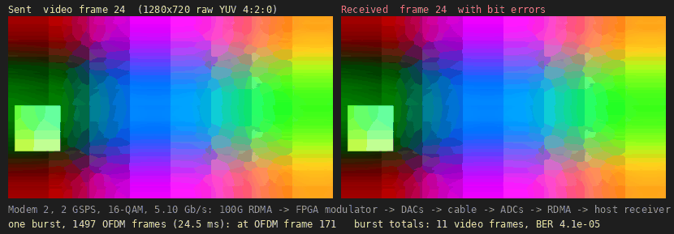
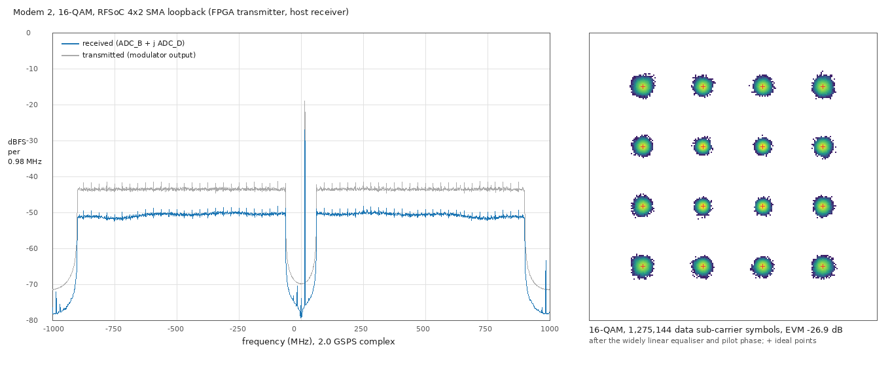
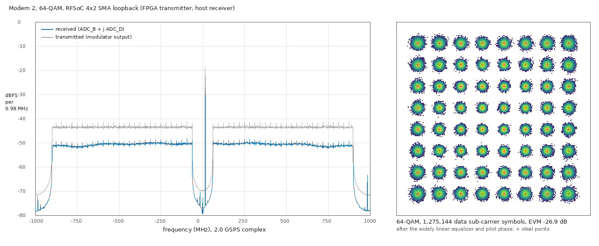
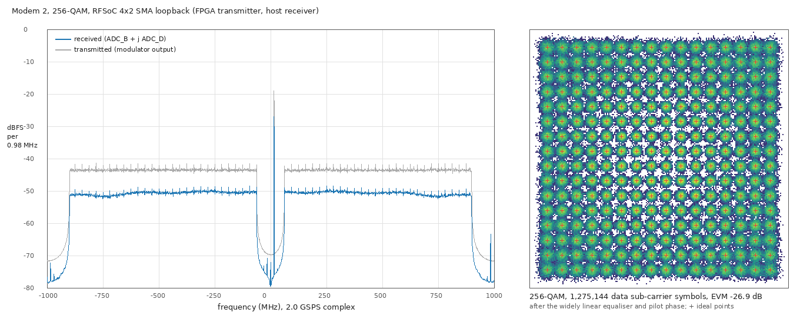

-9A90FD.svg) -orange.svg) -purple.svg)   

[English](#en) | [中文](#cn)

　

<span id="en">RFSoC 4x2: 2 GSPS OFDM with the host CPU as the modem, over 100G RDMA</span>
===========================

Continuous I/Q streaming between a Linux host and the RF data converters of the RFSoC 4x2 (XCZU48DR), carried by RoCE v2 (AMD ERNIC) on the QSFP28 port: **64 Gbit/s to the DACs and 64 Gbit/s from the ADCs at the same time, i.e. 2.0 GSPS × I/Q × 16 bit each way.** The OFDM transmitter and receiver run in C on the host CPU. Through a loopback cable (DAC_A → ADC_B for I, DAC_B → ADC_D for Q, multi-tile synchronised) the link carries raw, uncompressed video.

* **Modem 2** ([zcu208_4gsps_ofdm](https://github.com/uceeyuf/zcu208_4gsps_ofdm#modem-2-two-independent-ends)): the transmitter in the FPGA modulates scrambled 720p video at 16-QAM (5.10 Gb/s); the host captures a burst of raw ADC samples and demodulates it offline. One 24.5 ms burst of 1497 OFDM frames holds 11 consecutive video frames, BER 4.1 × 10⁻⁵; every error falls on the four sub-carriers where the converters repeat the RF pilot at ± j fs / 8 (a known spur of this board).
It combines [rfsoc4x2_ernic](https://github.com/uceeyuf/rfsoc4x2_ernic) (100G RDMA) with [rfsoc4x2_mts](https://github.com/uceeyuf/rfsoc4x2_mts) (multi-tile sync, I/Q OFDM), both ported to Vivado 2023.2 and the RF side to 2.0 GSPS.

**The OFDM modem in the FPGA** (transmitter and receiver bit-exact with their C models, on this streaming core; 2 GSPS on the board, 4 GSPS in progress) continues in [zcu208_4gsps_ofdm](https://github.com/uceeyuf/zcu208_4gsps_ofdm).

　

|  |
| :------------------------------------: |
| **Figure1** : Modem 2, 16-QAM, 720p, one burst: the video frame sent (left) and received (right) |

　

## How it works

```
host CPU: video -> scrambler -> OFDM modulators (3 threads) -> TX frame ring (16 MB) --RDMA WRITE--> rf_stream TX ring (2 MB) -> DAC_A / DAC_B
host CPU: checker <- OFDM demodulators (12 threads) <- RX ring (64 MB) <--RDMA WRITE WITH IMMEDIATE-- rf_stream RX ring (512 KB) <- ADC_B / ADC_D
```

* **rf_stream** (`hw/rtl/rf_stream.v`) sits in ERNIC's on-chip window at `0x8000_0000` behind an address split.
  * **TX**: the host RDMA WRITEs samples into a 2 MB TX ring (262 µs at 8 GB/s) and posts its write pointer. The player sends 512 bits every two 250 MHz RF cycles to the DACs (8 samples per rail per cycle). The host paces itself on the read pointer, read with an RDMA READ of a 64-byte status word.
  * **RX**: the ADCs fill 64 KB chunks. Every full chunk rings ERNIC's SQ doorbell over the hardware handshake ports. One of 1024 pre-filled RDMA WRITE WITH IMMEDIATE WQEs then sends the chunk to host ring slot *k* (immediate *k*), and its completion frees the chunk. No processor is involved on either path.
  * **Keeping time**: the TX read pointer never waits. A word the host has not written in time plays as zeros, so later samples stay on the time grid, and the host skips ahead. An RX overflow drops whole 512-bit words, which the FPGA counts.
  * **Restarting**: ERNIC keeps its SQ consumer index when a QP is configured again, so the SQ producer index runs on from run to run. The host stops cleanly, waiting until every RX chunk is completed.
* **Clocks**: ERNIC runs at 200 MHz and the RF fabric at 250 MHz (2.0 GSPS, 8 samples per cycle). The MTS block design (LMK04828 / LMX2594 from the A53, tile 2 PLL, SYSREF 5 MHz) comes from rfsoc4x2_mts.
* **Host modem** (`host/ofdm_modem.c`): N = 1024, CP = 128, 890 active sub-carriers (±16 … ±460) with 56 pilots. A frame of 32768 samples holds 2 training symbols, 26 data symbols and 512 zeros. The receiver uses a widely linear equaliser that also removes the I/Q image.
  * FFTW-based when libfftw3f is installed (a built-in radix-2 FFT otherwise).
  * Transmitter: about 1 GS/s per core.
  * Receiver: about 310 MS/s per core on a Core Ultra 7 265K.
* **rf_ofdm** (`host/rf_ofdm.c`):
  * Sends the payload scrambled: flat video would otherwise put the same point on every sub-carrier, and the IFFT turns that into one huge peak.
  * Locks to the frame grid once. The ADCs and DACs share the sample clock, so the grid then holds.
  * Demodulates every frame at its known position, from a copy taken out of the ring.
  * Checks the sequence numbers and bit errors against the source, and reassembles the video.
  * Moves the grid by the exact shift after an RX overflow (16 samples per dropped word), and falls back to a full frame search if headers stay bad.

　

## Results

Host: Core Ultra 7 265K (8 P + 12 E cores), Mellanox ConnectX-4 (PCIe 3.0 x16), Ubuntu 24.04, CPUs 4-7 isolated. Board: RFSoC 4x2, SMA loopback DAC_A → ADC_B, DAC_B → ADC_D.

| Test | Result |
| :--- | :----- |
| Streaming (`rf_stream_host`, tone), 10 s | 64.00 Gbit/s to the DACs and 64.00 Gbit/s from the ADCs, 0 RX gaps, 0 TX underflows, 0 RX overflows |
| Modem 2 on the board (FPGA transmitter, host receiver on raw ADC captures; [zcu208_4gsps_ofdm](https://github.com/uceeyuf/zcu208_4gsps_ofdm#modem-2-two-independent-ends)) | 16-QAM (5.10 Gb/s), SMA loopback, 3 captures, 44.7 M bits: EVM −26.9 dB, BER 4.2 … 4.6 × 10⁻⁵, every error on four sub-carriers where the converters put the RF pilot again at ± j fs / 8 (a known spur, −36 dBc; without those 12 sub-carriers 0 errors in 5.0 M bits) |
| Modem 2, two independent ends, worst case (C model) | two 300 kHz lasers, carrier offset 5 MHz, sample clocks 50 ppm apart, IQ imbalance at both ends, SNR 30 dB, 16-QAM, receiver in fixed point, 12 seeds × 30 frames: BER 1.21 × 10⁻⁴ (1 polarization), 1.59 × 10⁻⁴ (2 polarizations, worst seed 3.62 × 10⁻⁴) |
| MTS | DAC_B / ADC_D vs DAC_A / ADC_B after sync: +0.012 … +0.014 samples (6 … 7 ps) ([log](./docs/results/mts_2gsps_board_log.txt)) |
| Timing, resources | all constraints met (WNS +0.141 ns); BRAM 64 %, UltraRAM 75 %, DSP 0.1 %, LUT 28 % ([report](./docs/results/rdma_ofdm_timing_summary.rpt), [utilisation](./docs/results/rdma_ofdm_utilization.rpt), [by instance](./docs/results/rdma_ofdm_utilization_hierarchical.rpt)) |

**What the buffers are sized for.** With the CPU busy, the NIC's DMA pauses for up to ~0.3 ms every few seconds, occasionally for several ms. The status READ and the data WRITEs stall together.
* The 2 MB TX ring bridges these pauses. With 1 MB, every pause was a TX underflow.
* The 64 MB host RX ring (8 ms) covers demodulator threads that get preempted. With 16 MB, a few hundred frames per minute were overwritten before they were read.
* What is left is the rare pause longer than the 512 KB FPGA RX ring (65 µs): an RX overflow, after which the grid shift is exact.

A CPU package that reaches TjMax (105 °C) throttles, and each throttle event is such a pause. Keep the host cool, and keep sysfs reads (MSRs) off the RDMA engine's thread.

　

## Spectrum and constellation

Modem 2 on the board: the FPGA transmitter, 64 frames of raw ADC samples of the running link (`rf_ofdm --m2 1 --dump`), the host receiver of [zcu208_4gsps_ofdm](https://github.com/uceeyuf/zcu208_4gsps_ofdm#modem-2-two-independent-ends) (fixed point, as planned for the FPGA), drawn by `host/plot_ofdm.py`.
* **Left**: the received PSD (blue) against the transmitter's own output, its bit-exact model at the same digital level (grey).
  * Welch estimate: 2048-point FFT, Hann window, 0.98 MHz bins.
  * Data on 62.5 … 898 MHz on both sides (804 data sub-carriers, 54 pilots); the RF pilot tone at +15.6 MHz.
  * The analogue path costs about 7 dB, and the band stays flat within about ±1.5 dB; the noise floor near DC and above ±898 MHz is about −77 dBFS.
* **Right**: every data sub-carrier symbol after the widely linear combiner and the per-symbol pilot phase, as a density plot, with the ideal points.
  * EVM is −26.9 dB for 16, 64 and 256-QAM alike: the link is limited by its SNR, not by the modulation. BER 3.8 × 10⁻⁵ / 4.9 × 10⁻⁴ / 3.7 × 10⁻³.

|  |
| :--------------------------------: |
| **Figure2** : Modem 2, 16-QAM, EVM −26.9 dB |

|  |
| :--------------------------------: |
| **Figure3** : Modem 2, 64-QAM, EVM −26.9 dB |

|  |
| :----------------------------------: |
| **Figure4** : Modem 2, 256-QAM, EVM −26.9 dB |

　

## Build and run

Requirements:
* Vivado / Vitis 2023.2 with an ERNIC licence.
* RFSoC 4x2 board files ([RealDigitalOrg/RFSoC4x2-BSP](https://github.com/RealDigitalOrg/RFSoC4x2-BSP), in `~/fpga/board_files`).
* rdma-core; libfftw3f (optional, GPL: see License).
* The host port at 192.168.100.2/24 with MTU 9000.
* For clean runs:
  * kernel command line `isolcpus=4-7 nohz_full=4-7 irqaffinity=0-3,8-19`, so the RDMA engine (CPU 7) and the TX threads (CPUs 4-6) run undisturbed;
  * `sudo tests/host_tune.sh` after every boot (governor `performance`).

```sh
git submodule update --init
vivado -mode batch -source hw/scripts/build.tcl -tclargs 4          # build/rdma_ofdm.bit, .xsa (4 parallel runs: 30 GB RAM)
xsct sw/create_vitis.tcl build/rdma_ofdm.xsa sw/vitis_rdma          # A53 application: clocks, RF tiles, MTS
host/build.sh                                                        # ofdm_bench, rf_stream_host, rf_ofdm
hw/sim/run.sh                                                        # rf_stream testbench (xsim)
tests/stream_up.sh 1 host/rf_stream_host --seconds 10 --tx tone:100  # program, MTS, configure ERNIC, stream a tone
tests/stream_up.sh 0 host/rf_ofdm --seconds 60 --save build/rx.yuv --save-frames 120 --save-every 225
tests/stream_up.sh 0 host/rf_ofdm --m 6 --video 1920x1080 --seconds 60
python3 host/make_gif.py build/rx.yuv 1280x720 build/rx_720p.gif
tests/stream_up.sh 0 host/rf_ofdm --m 4 --seconds 4 --dump build/rx_m4.dump     # raw samples of 64 frames
host/ofdm_plots build/rx_m4.dump build/plot_m4                                  # EVM, spectrum, symbols
python3 host/plot_ofdm.py build/plot_m4 build/ofdm_16qam.png
```

* `tests/stream_up.sh 1` loads the bitstream and the A53 application over JTAG, then sends key `m` (MTS) over the UART.
* The host program writes its QP number, MAC and RX ring address to `build/stream_params.txt`. `tests/stream_config.tcl` programs ERNIC over JTAG-to-AXI (1024 WQEs) and signals the host once Vivado has let go of the CPU.
* Without a board:
  * `host/rf_ofdm --sim 1` loops the TX stream back in memory;
  * `--sim-slip N` shifts it like an RX overflow;
  * `host/ofdm_bench` measures the modem's speed.
* The standalone MTS design (buffer play / capture, A53 OFDM) is still built by `hw/scripts/make_mts.tcl` and `build_mts.tcl` (`MTS_GSPS=4.0` builds it at 4 GSPS).

　

## Files

| Path | |
| :--- | :-- |
| `hw/rtl/rdma_ofdm_top.v` | top level: CMAC, ERNIC, DDR4, address splits, MTS block design, rf_stream |
| `hw/rtl/rf_stream.v` | TX / RX rings (RX in UltraRAM), doorbells, status word |
| `hw/sim/` | rf_stream testbench |
| `hw/scripts/mts_bd.tcl` | MTS block design (RFDC, clocks, players, captures; DAC source mux and ADC taps when integrated) |
| `host/rf_ofdm.c` | continuous OFDM video link |
| `host/rf_stream_host.c` | streaming test (tone), with READ / WRITE latency statistics (`LAT=1`) |
| `host/rdma_link.c` | RC QP to ERNIC, clean stop |
| `host/ofdm_modem.c`, `ofdm_bench.c` | OFDM modem and its benchmark |
| `host/ofdm_plots.c`, `plot_ofdm.py` | spectrum, constellation and EVM from a raw sample dump |
| `sw/src` | A53 application (clocks, RF tiles, MTS, buffer-mode OFDM) |
| `tests/stream_config.tcl`, `stream_up.sh`, `host_tune.sh` | ERNIC configuration over JTAG, bring-up, host tuning |

　

## Citation

If this work helps your research, please cite it:

```bibtex
@misc{yu2026rfsoc4x2_rdma_ofdm,
    author = {Yijie Yu},
    title = {{RFSoC 4x2: 2 GSPS OFDM with the host CPU as the modem, over 100G RDMA}},
    year = {2026},
    howpublished = {\url{https://github.com/uceeyuf/rfsoc4x2_rdma_ofdm}},
    note = {GitHub repository},
}
```

GitHub also offers the citation under **Cite this repository** (from [CITATION.cff](CITATION.cff)).

　

## Credits

* RDMA side: [rfsoc4x2_ernic](https://github.com/uceeyuf/rfsoc4x2_ernic).
* RF side: [rfsoc4x2_mts](https://github.com/uceeyuf/rfsoc4x2_mts).
* URAM player / capture blocks (`third_party/rfsoc_mts`) and the MTS design approach: [Xilinx/RFSoC-MTS](https://github.com/Xilinx/RFSoC-MTS) (MIT, `third_party/rfsoc_mts/LICENSE`).
* Clock register values: PYNQ RFSoC4x2 `LMK04828_500.0` / `LMX2594_500.0`.
* SPI driver: from [RFSoC4x2_clock_LMK_LMX](https://github.com/uceeyuf/RFSoC4x2_clock_LMK_LMX).
* RF data converter driver: Xilinx `rfdc`.
* Ethernet / AXI stream modules: Alex Forencich's [verilog-ethernet](https://github.com/alexforencich/verilog-ethernet) (MIT, submodule pinned at `274831c`).
* PL DDR4 pin constraints (`hw/constraints/4x2_PL_DDR4.xdc`): the RFSoC 4x2 board's DDR4 constraints.
* Host FFT: [FFTW](https://www.fftw.org) (Frigo and Johnson).

　

## License

* The files of this design are BSD 3-Clause, Copyright (c) 2026, Yijie Yu.
* `third_party/rfsoc_mts` (AMD) and verilog-ethernet are MIT.
* ERNIC, CMAC, MIG, the RF data converter and the other AMD IP are generated from their configuration scripts and are not included; they need their own licenses.
* The host modem uses FFTW (GPL-2.0-or-later) when `libfftw3f` is installed: `host/build.sh` then links it, and binaries built that way fall under the GPL. Without FFTW the built-in FFT is used.

　

<span id="cn">RFSoC 4x2：主机 CPU 做调制解调的 2 GSPS OFDM（100G RDMA）</span>
===========================

Linux 主机与 RFSoC 4x2（XCZU48DR）射频数据转换器之间的连续 I/Q 流，由 QSFP28 口上的 RoCE v2（AMD ERNIC）承载：**同时 64 Gbit/s 送往 DAC、64 Gbit/s 来自 ADC，即双向 2.0 GSPS × I/Q × 16 bit。** OFDM 发射机和接收机都在主机 CPU 上用 C 实现。经过环回线缆（I：DAC_A → ADC_B，Q：DAC_B → ADC_D，多 tile 同步），链路传送未压缩的原始视频。

* **Modem 2**（[zcu208_4gsps_ofdm](https://github.com/uceeyuf/zcu208_4gsps_ofdm#modem-2两端独立)）：FPGA 内的发射机以 16-QAM（5.10 Gb/s）调制加扰后的 720p 视频；主机采集一段原始 ADC 样本的 burst 并离线解调。一次 24.5 ms、1497 个 OFDM 帧的 burst 含 11 帧连续视频，BER 4.1 × 10⁻⁵；误码全部落在 4 个子载波上，即转换器把射频导频复制到 ± j fs / 8 的位置（本板已知杂散）。
本仓库结合了 [rfsoc4x2_ernic](https://github.com/uceeyuf/rfsoc4x2_ernic)（100G RDMA）与 [rfsoc4x2_mts](https://github.com/uceeyuf/rfsoc4x2_mts)（多 tile 同步、I/Q OFDM），两者移植到 Vivado 2023.2，射频侧提到 2.0 GSPS。

**FPGA 内的 OFDM 调制解调**（发射机和接收机与各自的 C 模型逐位一致，基于本仓库的流式核心；2 GSPS 已上板，4 GSPS 进行中）在 [zcu208_4gsps_ofdm](https://github.com/uceeyuf/zcu208_4gsps_ofdm) 继续。

## 原理

* **rf_stream**（`hw/rtl/rf_stream.v`）位于 ERNIC 片上窗口 `0x8000_0000`。
  * **TX**：主机用 RDMA WRITE 写 2 MB TX 环（8 GB/s 下可撑 262 µs）并更新写指针，播放器每两个 250 MHz 周期向 DAC 送 512 bit；主机通过 RDMA READ 64 字节状态字获得读指针来定速。
  * **RX**：ADC 填满 64 KB 块后，经硬件握手口敲 ERNIC 的 SQ 门铃，由 1024 个预置的 RDMA WRITE WITH IMMEDIATE WQE 发到主机环第 *k* 槽，完成后释放该块，全程无处理器参与。
  * **按时间走**：TX 读指针从不等待，主机没来得及写的字播放为零，后续样本保持在时间网格上，主机跳帧追上；RX 溢出按整个 512 bit 字丢弃，FPGA 记录丢弃数。
  * **重跑**：ERNIC 重新配置 QP 时保留 SQ 消费指针，因此 SQ 生产指针跨运行累加；主机退出前等所有 RX 块完成。
* **主机调制解调**（`host/ofdm_modem.c`）：N = 1024、CP = 128，890 个有效子载波，其中 56 个导频；每帧 32768 个样本。
  * 装有 libfftw3f 时使用 FFTW，否则用内置的 radix-2 FFT。
  * 发射每核约 1 GS/s，接收每核约 310 MS/s。
  * 接收端用宽线性均衡器，同时去除 I/Q 镜像。
* **rf_ofdm**（`host/rf_ofdm.c`）：
  * 载荷先加扰码，避免平坦视频在 IFFT 后形成巨大峰值。
  * 只锁定一次帧网格：ADC 与 DAC 共用采样时钟，锁定后网格保持不变。
  * 每帧先从环中拷出再解调。
  * 对照源数据检查序号和误码，并重组视频。
  * RX 溢出后按精确平移量移动网格（每丢一个字 16 个样本），帧头持续错误时再做全搜索。

## 结果

| 测试 | 结果 |
| :--- | :--- |
| 流测试（单音）10 s | 双向 64.00 Gbit/s，0 RX gap，0 TX underflow，0 RX overflow |
| Modem 2 上板（FPGA 发射，主机解原始 ADC 采集；[zcu208_4gsps_ofdm](https://github.com/uceeyuf/zcu208_4gsps_ofdm#modem-2两端独立)） | 16-QAM（5.10 Gb/s），SMA 环回，3 次采集共 44.7 M bit：EVM −26.9 dB，BER 4.2 … 4.6 × 10⁻⁵，误码全部在 4 个子载波上，即转换器把射频导频复制到 ± j fs / 8 的位置（已知杂散，−36 dBc；不计这 12 个子载波时 5.0 M bit 0 误码） |
| Modem 2，两端独立，最坏情况（C 模型） | 两个 300 kHz 激光器，载波频偏 5 MHz，采样时钟相差 50 ppm，两端 IQ 失衡，SNR 30 dB，16-QAM，接收机定点，12 个种子 × 30 帧：BER 1.21 × 10⁻⁴（1 个偏振），1.59 × 10⁻⁴（2 个偏振，最差种子 3.62 × 10⁻⁴） |
| MTS | 同步后 DAC_B / ADC_D 相对 DAC_A / ADC_B：+0.012 … +0.014 样本（6 … 7 ps） |
| 时序、资源 | 全部满足（WNS +0.141 ns）；BRAM 64 %，UltraRAM 75 %，DSP 0.1 %，LUT 28 % |

**缓冲区大小的依据**：CPU 满载时，网卡 DMA 每隔几秒会停顿最多约 0.3 ms，偶尔达到数 ms，状态读和数据写同时停。
* 2 MB 的 TX 环能跨过这些停顿；用 1 MB 时每次停顿都会造成 TX underflow。
* 64 MB 的主机 RX 环（8 ms）能扛住解调线程被抢占；用 16 MB 时每分钟有几百帧在读之前就被覆盖。
* 剩下的是少数长于 FPGA 512 KB RX 环（65 µs）的停顿，表现为 RX overflow，之后网格可以精确平移。

CPU 封装达到 TjMax（105 °C）时会热降频，每次降频就是一次这样的停顿，所以主机要做好散热，RDMA 引擎线程也不要读 sysfs（MSR）。

## 频谱与星座图

Modem 2 上板：FPGA 发射机，取运行中链路的 64 帧原始 ADC 样本（`rf_ofdm --m2 1 --dump`），由 [zcu208_4gsps_ofdm](https://github.com/uceeyuf/zcu208_4gsps_ofdm#modem-2两端独立) 的主机接收机（按计划的 FPGA 实现做定点）处理，`host/plot_ofdm.py` 绘制（见上文图 2–4）。
* **左图**：接收 PSD（蓝）与发射机自身输出（其位精确模型，相同数字电平，灰）的对比。
  * Welch 估计：2048 点 FFT，Hann 窗，每格 0.98 MHz。
  * 数据在两侧 62.5 … 898 MHz（804 个数据子载波，54 个导频）；射频导频单音在 +15.6 MHz。
  * 模拟链路损耗约 7 dB，带内平坦度约 ±1.5 dB；DC 附近和 ±898 MHz 以外噪底约 −77 dBFS。
* **右图**：宽线性合并与逐符号导频相位校正之后的全部数据子载波符号密度图，叠加理想星座点。
  * 16 / 64 / 256-QAM 的 EVM 都是 −26.9 dB，说明链路受 SNR 限制，与调制阶数无关。BER 3.8 × 10⁻⁵ / 4.9 × 10⁻⁴ / 3.7 × 10⁻³。

构建与运行步骤见上文英文部分（建议 `isolcpus=4-7`，每次开机后运行 `sudo tests/host_tune.sh`）。

　

## 引用

如果这个项目对你的研究有帮助，请引用：

```bibtex
@misc{yu2026rfsoc4x2_rdma_ofdm,
    author = {Yijie Yu},
    title = {{RFSoC 4x2: 2 GSPS OFDM with the host CPU as the modem, over 100G RDMA}},
    year = {2026},
    howpublished = {\url{https://github.com/uceeyuf/rfsoc4x2_rdma_ofdm}},
    note = {GitHub repository},
}
```

GitHub 仓库页的 **Cite this repository** 也提供同样的引用（来自 [CITATION.cff](CITATION.cff)）。

　

## 致谢

* RDMA 部分：[rfsoc4x2_ernic](https://github.com/uceeyuf/rfsoc4x2_ernic)。
* 射频部分：[rfsoc4x2_mts](https://github.com/uceeyuf/rfsoc4x2_mts)。
* URAM 播放 / 采集模块（`third_party/rfsoc_mts`）和 MTS 设计思路：[Xilinx/RFSoC-MTS](https://github.com/Xilinx/RFSoC-MTS)（MIT，`third_party/rfsoc_mts/LICENSE`）。
* 时钟寄存器值：PYNQ RFSoC4x2 `LMK04828_500.0` / `LMX2594_500.0`。
* SPI 驱动：来自 [RFSoC4x2_clock_LMK_LMX](https://github.com/uceeyuf/RFSoC4x2_clock_LMK_LMX)。
* RF 数据转换器驱动：Xilinx `rfdc`。
* 以太网 / AXI stream 模块：Alex Forencich 的 [verilog-ethernet](https://github.com/alexforencich/verilog-ethernet)（MIT，子模块 `274831c`）。
* PL DDR4 管脚约束（`hw/constraints/4x2_PL_DDR4.xdc`）：RFSoC 4x2 板卡的 DDR4 约束。
* 主机端 FFT：[FFTW](https://www.fftw.org)（Frigo 与 Johnson）。

　

## 许可证

* 本设计的文件采用 BSD 3-Clause，版权所有 (c) 2026 Yijie Yu。
* `third_party/rfsoc_mts`（AMD）与 verilog-ethernet 为 MIT。
* ERNIC、CMAC、MIG、RF 数据转换器等 AMD IP 由配置脚本生成，不包含在仓库中，需要各自的许可证。
* 主机调制解调在装有 `libfftw3f` 时使用 FFTW（GPL-2.0-or-later）：此时 `host/build.sh` 会链接它，这样构建出的程序受 GPL 约束；没有 FFTW 时使用内置 FFT。
